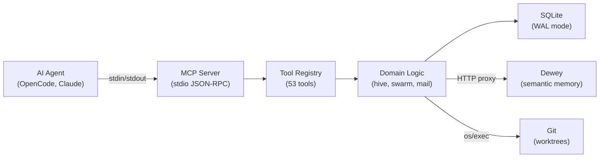

# Replicator

[](https://github.com/unbound-force/replicator/actions/workflows/ci.yml)

[](LICENSE)

Multi-agent coordination for AI coding agents. Single Go binary, zero runtime dependencies.

> Go rewrite of [cyborg-swarm](https://github.com/unbound-force/cyborg-swarm) (TypeScript). Same tools, same protocol, faster startup, simpler distribution.

## Status

**53 MCP tools** | **190+ tests** | **15MB binary** | **<50ms startup**

All 5 implementation phases are complete:

- [x] Phase 0: MCP server, SQLite, tool registry
- [x] Phase 1: Hive (11 tools) + Swarm Mail (10 tools)
- [x] Phase 2: Swarm Orchestration (24 tools)
- [x] Phase 3: Memory / Dewey proxy (8 tools)
- [x] Phase 4: CLI (9 commands)
- [x] Phase 5: Parity testing (100% shape match)

## Install

### Homebrew (macOS)

```bash
brew install unbound-force/tap/replicator
```

### Go Install

```bash
go install github.com/unbound-force/replicator/cmd/replicator@latest
```

### Binary Download

Download from [GitHub Releases](https://github.com/unbound-force/replicator/releases). Available for macOS (arm64), Linux (amd64, arm64).

## Usage

```bash
# Per-repo setup (creates .uf/replicator/ directory)
replicator init

# Per-machine setup (creates ~/.config/uf/replicator/ + SQLite DB)
replicator setup

# Start MCP server (AI agents connect via stdio)
replicator serve

# List work items
replicator cells

# Check environment health
replicator doctor

# Activity summary
replicator stats

# Run preset analytics queries
replicator query cells_by_status

# Generate tool reference docs
replicator docs

# Version info
replicator version
```

## MCP Tools (53)

Replicator exposes 53 tools via the [MCP protocol](https://modelcontextprotocol.io/) over stdio JSON-RPC:

| Category | Tools | Purpose |
|----------|-------|---------|
| **Hive** | 11 | Work item tracking: create, query, update, close, epics, sessions, sync |
| **Swarm Mail** | 10 | Agent messaging: send, inbox, ack, file reservations |
| **Swarm** | 24 | Orchestration: decompose, spawn, worktrees, progress, review, insights |
| **Memory** | 8 | Dewey proxy: store/find learnings, deprecated tool stubs |

See the full [Tool Reference](docs/tools.md) for schemas and examples.

## Connecting an AI Agent

Add replicator to your `opencode.json`:

```json
{
  "mcp": {
    "replicator": {
      "type": "stdio",
      "command": "replicator",
      "args": ["serve"]
    }
  }
}
```

For Claude Code, add to `mcp_servers` in your config:

```json
{
  "mcp_servers": {
    "replicator": {
      "command": "replicator",
      "args": ["serve"]
    }
  }
}
```

## Environment Variables

| Variable | Default | Purpose |
|----------|---------|---------|
| `REPLICATOR_DB` | `~/.config/uf/replicator/replicator.db` | SQLite database path |
| `DEWEY_MCP_URL` | `http://localhost:3333/mcp/` | Dewey semantic memory endpoint |
| `ZEN_API_KEY` | *(none)* | OpenCode Zen gateway for LLM calls |

## Architecture



### Package Layout

```
cmd/replicator/       CLI entrypoint (cobra)
internal/
  config/             Configuration (env vars, defaults)
  db/                 SQLite + migrations (7 tables)
  hive/               Cell CRUD, epics, sessions, sync
  swarmmail/          Agent messaging, file reservations
  swarm/              Decomposition, spawning, worktrees, review, insights
  memory/             Dewey proxy, deprecated tool stubs
  gitutil/            Git worktree operations (os/exec)
  doctor/             Health check engine
  stats/              Database activity summary
  query/              Preset SQL analytics
  mcp/                MCP JSON-RPC server + structured logging
  ui/                 Centralized lipgloss styles + table helpers
  tools/
    registry/         Tool registration framework
    hive/             Hive tool handlers (11)
    swarmmail/        Swarm mail tool handlers (10)
    swarm/            Swarm tool handlers (24)
    memory/           Memory tool handlers (8)
test/parity/          Shape comparison engine + fixtures
docs/                 Generated tool reference
```

## Development

```bash
make build    # Build binary to bin/replicator
make test     # Run all tests
make vet      # Go vet
make check    # Vet + test
make serve    # Build and run MCP server
make release  # GoReleaser dry-run (local)
make install  # Install to GOPATH/bin
```

See [CONTRIBUTING.md](CONTRIBUTING.md) for development setup and PR workflow.

## Credits

Go rewrite of [cyborg-swarm](https://github.com/unbound-force/cyborg-swarm), originally forked from [swarm-tools](https://github.com/joelhooks/swarm-tools) by [Joel Hooks](https://github.com/joelhooks). See [LICENSE](LICENSE).
